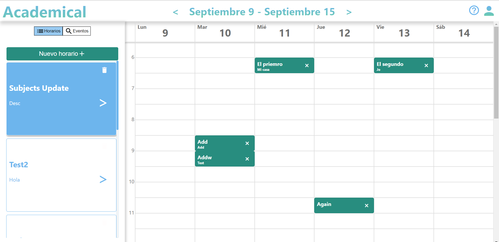

# Academical-reborn

This app allows people to plan their schedule based on custom events and cultural events offered by the Los Andes University.

## Colaborators

- Carlos Mario Sarmiento: Alias "El Korkies"

  [Personal Site](https://korkies22.github.io/Portfolio/) - [GitHub](https://github.com/korkies22/)

- Sergio Guzmán Mayorga: Alias "El Checho"

  [Personal Site](https://sguzmanm.github.io/i-am-sergio-guzman/) - [GitHub](https://github.com/sguzmanm)

## Links

**Deployed at:** https://protected-inlet-87189.herokuapp.com/

## Description

With Academical Reborn people from the Los Andes University can get to know which events the university offers and plan them into their schedule.
The person must register in the system. Later, that user can create schedules and for each schedules he/she can add events.
The events are composed by a name, description and a date. The events are shown in the calendar by hovering and added by clicking on them. If the event crosses with one another, the hovered event shows a red background.
The person can switch between weeks to be able to see which events he/she has included. He can also switch between schedules to be able to see the events in each of them.

## Objective

We want to allow people to be able to know which cultural events the university offers, and plan them within their schedule.

## Tecnologies used

This project was developed using the MERN stack.

- **Mongo DB**: MongoDB was used as a NOSQL database. Here users,schedules and events are stored.
- **Express**: A fast, minimalistic and flexible framework for Node.js, it allows route handling in an easy way. https://expressjs.com/es/
- **React JS**: A Front End library useful for creating components. https://reactjs.org/
- **Node JS**: A javascript environment which allows to create a web server with javascript. https://nodejs.org

Some extra dependencies were included in the project. Each can be seen in the backend or frontend folders or in the package.json files in the respective folders.

The application is deployed in https://heroku.com/
((Las instrucciones de ejecucion son muy claras. Bien!))
## Instructions to execute

### Requisites

- **Node JS**
- **Heroku CLI (Optional, for replicating our deployment only)**

Verify that nodejs is installed by running "node -v" on terminal or cmd. It can be downloaded in https://nodejs.org/ (versión LTS)

### Steps to run develop version

1. Check backend folder for complete instructions on how to execute the backend
2. Check frontend folder for complete instructions on how to execute the frontend

### Steps to deploy production version into Heroku

It is assumed that the Heroku CLI is setup in your computer for this and connected to a project. If you are not sure or do not have this, please visit https://devcenter.heroku.com/articles/getting-started-with-nodejs.

1. Follow build instructions on frontend folder
2. Setup env vars in heroku of the backend .env file, by [dashboard](https://dashboard.heroku.com/) or CLI with:

```
heroku config:set <KEY>=<value>
```

3. Deployment in heroku needs you to push only the "backend" folder into the heroku´s master branch. For this, use the following command:

```
git subtree push --prefix backend heroku master
```

## Screenshots

### Main Menu



## License

This project is public under the MIT license, found [here](https://github.com/sguzmanm/academical-reborn/blob/master/LICENSE)
